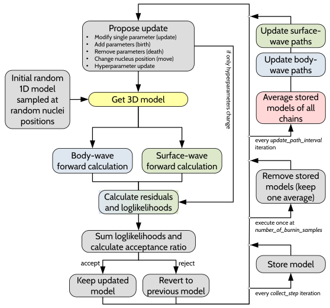

# baytomo3d - 3D Transdimensional Reversible Jump McMC Tomography

This Python program implements a rj-McMC model search for a 3D seismic tomographic model. The input data can be surface-wave phase travel times (fundamental mode, Love and Rayleigh) or teleseismic body-wave travel times (P, Pdiff, S, SKS). Other surface wave types/modes or other body wave phases can be implemented by modifications in the SurfaceWaveMoudle.py or the BodyWaveModule.py. To get started, have a look at the associated article and at the example directory. Most of the program functionalities are explained in the __run_baytomo3d.py__ script directly. If you plan to use the code in your work, please see the citation statement below. The functionality of the program goes beyond what is published in the article, there are different options that were not used (wavlets, parallel tempering, etc.). Many of those are still in an experimental stage. The scripts are not fully documented, unfortunately. Some options are still under development and thus not yet properly described. Feel free to contact Emanuel Kaestle if you plan to use this program (contact information below).

The general workflow looks like the following



The code is based on previous works by Malcom Sambridge, Thomas Bodin and others. The user is referred to the article cited below for a proper list of references.

## Citation

Main article (open access)
Kästle, E.D.; Paffrath, M.; El-Sharkawy, A. (2025). Alpine crust and mantle structure from 3D Monte Carlo surface- and body-wave tomography. JGR Solid Earth, https://doi.org/10.1029/2024JB030101

Code
Kästle, E.D. (2025). baytomo3d - 3D Transdimensional Reversible Jump McMC Tomography. GFZ Data Services. https://doi.org/10.5880/fidgeo.2025.011

3D Alpine Model
Kästle, E.D.; Paffrath, M.; El-Sharkawy, A. (2025). Subsurface Vp and Vs model of crust and upper mantle under the Alps. GFZ Data Services. https://doi.org/10.5880/fidgeo.2025.009


## Datasets

In this repository, you can find the full ambient noise dataset used in Kästle et al., 2025 as well as an example dataset for the body wave P and S first arrival picks. Note that for the body wave data, absolute traveltimes have not been checked as only relative travel times were used in the related study.

## Installation

You need a Python (v. 3.xx, recommended: 3.10) installation and the following Python packages (I recommend installing Anaconda and installing the packages with __conda install package_name__):  
obspy (https://github.com/obspy/obspy you can follow the installation instructions for obspy and then continue with the other packages)  
numpy  
scipy  
mpi4py  
matplotlib  
cartopy  
pyproj  
gzip  
cmcrameri (for colormaps https://pypi.org/project/cmcrameri/)  
scikit-fmm (Python implementation of the fast-marching method https://github.com/scikit-fmm/scikit-fmm)  
pywt (optional, for wavelet parameterization)  

The standard method for the dispersion curve calculation is currently pysurf96aa which you need to install from https://github.com/ekaestle/pysurf96aa . Unfortunately, this currently only works with Python versions 3.10 or older (limitation of the pysurf96aa installer).
Alternatively, it is possible to use dccurve from the geopsy package (https://www.geopsy.org/wiki/index.php/Dispersion_curve_inversion). Since dccurve is written in Fortran, you have to make it executable in Python. Go to the dccurve folder and type the f2pycommands.sh in a command window. This will create a new file called dccurve.cpython-3xx....so. This new file can be loaded as python package. Use the test.py script in that folder to test whether it works. If everything works fine, copy the dccurve.cpython... file to the baytomo3d folder.
If the f2py compilation fails, it may be that you are missing some libraries or the right Qt version. The best option is probably to install dccurve from scratch from the geopsy homepage. Afterwards, all libraries should be present. dccurve is faster than pysurf96. To switch between the two options, check the __if else__ statement at the beginning of the SurfaceWaveModule.py file.

Once these packages are installed, the tomography scripts simply have to be copied to the folder where they are supposed to be executed. Keep the original folder structure, so that you have a working folder where you keep the run_....py scripts and a subfolder called baytomo3d where the program scripts are kept. You can execute the program from a console window by typing

_starting a model search_
```bash
python run_baytomo3d_test.py
```

_starting a model search on 8 parallel cores_
```bash
mpirun -np 8 python run_baytomo3d_test.py
```

## Scripts

__run_baytomo3d.py__
This is the main script that contains all the user parameters. You have to modify the search parameters and priors in the header of this script. All available options are explained inside the script.

__ModelSearch.py__
Gray color in the workflow image. This script contains the class for handling a single model search (=chain). It takes the parameters and priors defined by the user and sets up the model search. Proposing model updates (birth, death, move, etc.) is handled by this class and it accepts or rejects the modifications. Accepted models are stored within each chain.

__SurfaceWaveModule.py__
Green color in the workflow image. The script contains functions and a surface-wave class that is responsible for reading the data from a text file, calculating phase velocities, updating the paths in the phase-velocity maps, calculating the surface-wave residuals and likelihood. The surface wave matrix is also calculated with this script. It is possible to switch between finite-width ray-kernels or simple rays by setting the _wavelength_smoothing_ to True or False in the _create_A_matrix_ function.

__BodyWaveModule.py__
Blue color in the workflow image. The script contains functions and a body-wave class that is responsible for reading the data from a text file, tracing rays with TauP, updating the 3D ray paths and calculating the body-wave residuals and likelihood.

__Parameterization.py__
Yellow in the workflow image. This script handles the chosen parameterization (Voronoi cells or Wavelets). It keeps track of the current model and the proposal ratios for different model updates.

__HelperClasses.py__
Red in workflow image. The functions and classes in this script control all operations that are necessary to set up the parallel model search and that deal with communication between parallel processes. This includes distributed calculation of ray paths/kernels, parallel tempering, averaging of final models, etc.

__AverageModels.py__
Red in workflow image. This is a plotting function that takes the models from all chains, averages them and creates a set of plots.

__FMM.py__
A collection on functions necessary to calculate the ray paths.

## Examples

There are two example files in the folder

__run_baytomo3d_joint.py__
__run_baytomo3d_bodywaves_only.py__

These examples use subsets of the original datasets used in the publication of Kaestle et al., 2024. Have a look at the user defined parameters at the beginning of each example script. The input data format is explained there as well. Make sure that the run script you want to execute is in the same folder as the baytomo3d folder. It is then recommended running these examples with
```bash
mpirun -np 4 python run_baytomo3d_...py
```
There are also some convenience scripts that can be copied to the same folder where the run scripts are executed to a) inspect the modelsearch files of a running or already finished model search; b) plot the average model and create some informative plots; c) plot crossections similar in style to the ones in the article of Kaestle et al., 2024 (may have to be adapted to run).

## Further information

Feel free to contact E. Kaestle in case of questions (emanuel.kaestle@fu-berlin.de, emanuel-david.kaestle@bam.de).
